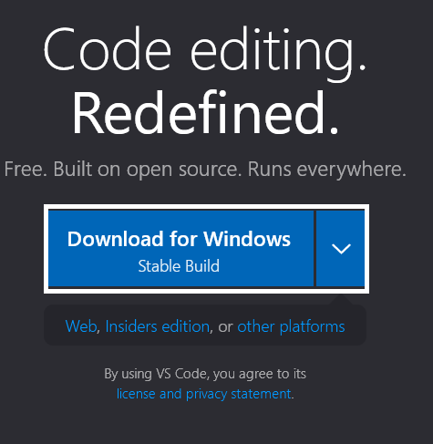
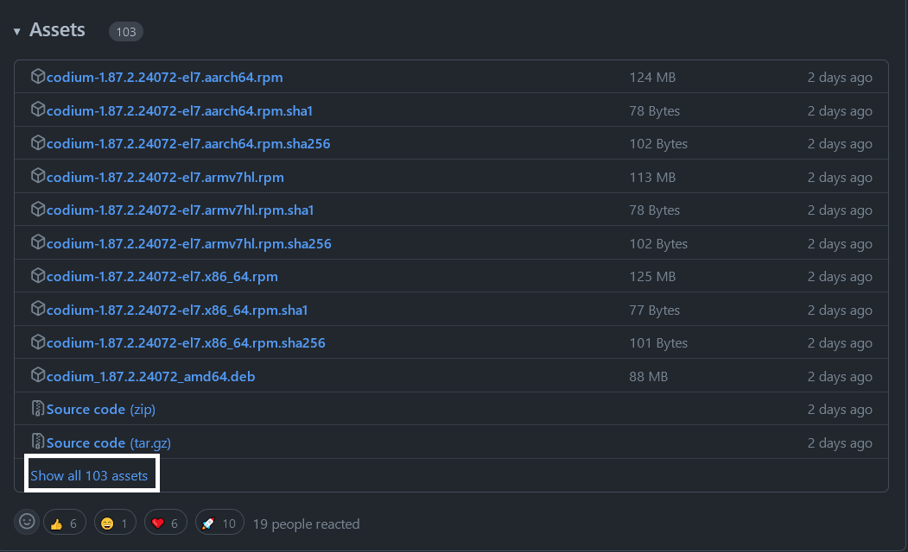
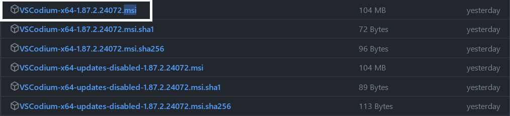
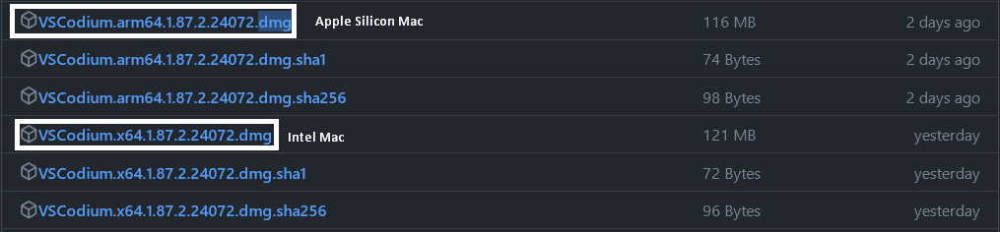
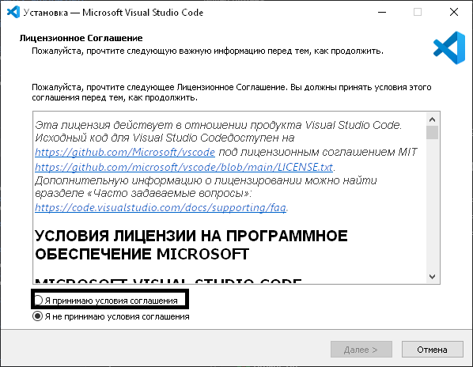
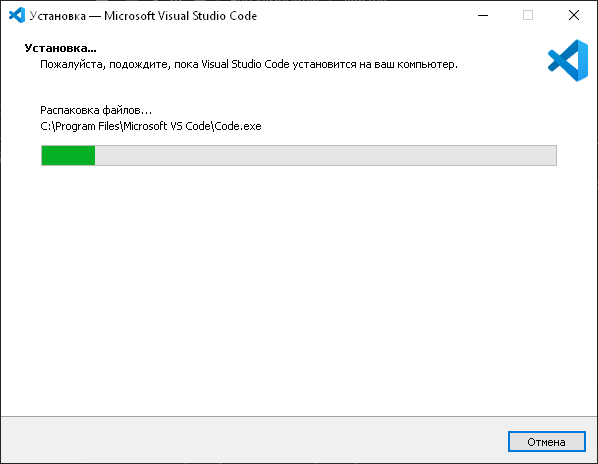
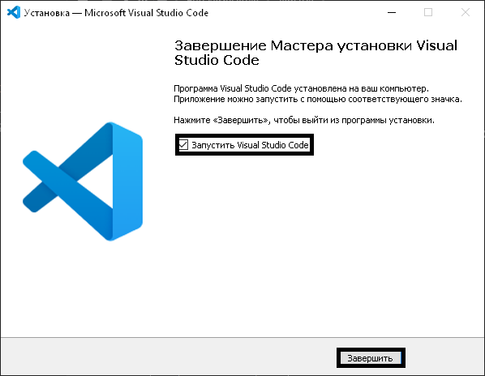
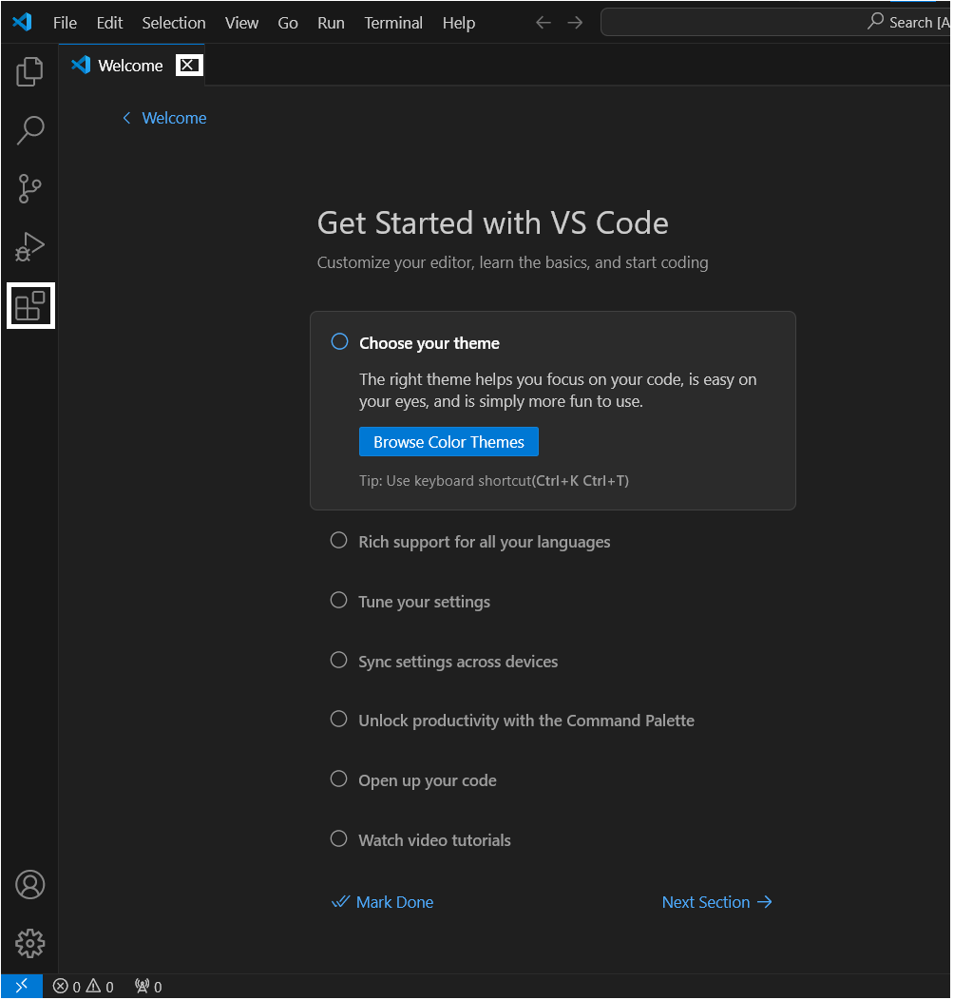

# Integrirovon dasturlash muhitni o'rnatish
IDE (ingiliz tilidan) yoki IDM bu Integrirovon dasturlash muhiti bolib
Bu sizga dasturlashda yordam beradigan maxsus programma boladi

## Python uchun IDE-lar
- Visual Studio Codium/Code
Ingiliz tilini biladiganlar uchun:
- PyCharm Community Edition*
- Thonny*
- Spyder*

\* - bu kursga hali qoshilmagan

# IDE-ni tortish

## VSCodium/Code
???+ info "Windows foydanalovchilar:"
    Bu huddi oddiy programmani ornatish dek 
### Windows va MacOS (VSCode)
!!! note "Tortib olish"
    
O'rnatovchini tortib olish uchun: [Visual Studio Code](https://code.visualstudio.com)
### Windows (VSCodium)
!!! note "Windows"
    <h3>
    1. 
    2. 
    3. ++ctrl+f++ va "msi" deb yozing 
    4. 
    </h3>

### MacOS (VSCodium)
!!! note "MacOS"
    <h3>
    1. 
    2. 
    3. ++ctrl+f++ va "dmg" deb yozing 
    4. 
    </h3>

### Linux
##### :simple-materialformkdocs: Linux-ga hali ishlar olib-borilmoqda :material-alert:
## IDE-ni ornatish
### VSCode
#### Windows
!!! warning ""
    O'rnatishda to'liq rasmlar yoq
!!! info ""
    <h2>
    1. 
    2. ++enter++-ni 2 matta bosing
    3. 
    4. 
    </h2>
#### MacOS
!!! warning "Rasmlar yoq chunki kurs faqat Windows noutbukida yaratilgan."
!!! info ""
    <h2>
    1. DMG-ni oching 
    2. Visual Studio Code-ni Applications papkasiga otkazing
    </h2>
#### Post-Install
!!! info ""
    <h2>
    1. 
    2. Internet yuq yangilash kerak
    </h2>