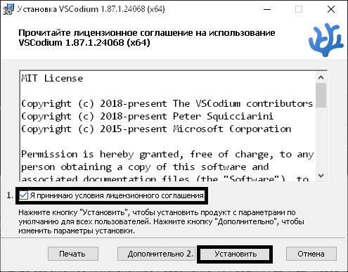
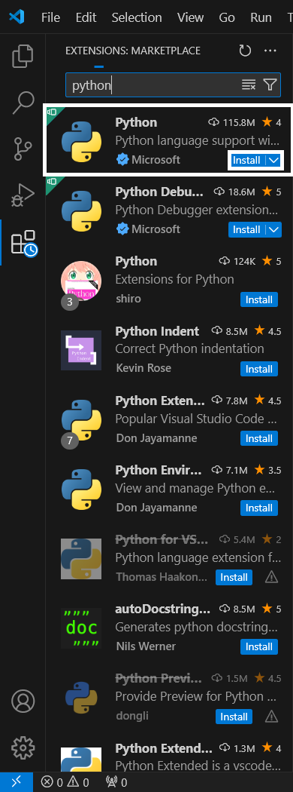

Integrirovon dasturlash muhitni o'rnatish
=========================================
IDE (ingiliz tilidan) yoki IDM bu Integrirovon dasturlash muhiti bolib

Bu sizga dasturlashda yordam beradigan maxsus programma boladi

Python uchun IDE-lar
-----------------------
- Visual Studio Codium/Code
Ingiliz tilini biladiganlar uchun:
- PyCharm Community Edition*
- Thonny*
- Spyder*

\* - bu kursga hali qoshilmagan

IDE-ni tortish
--------------

### VSCodium/Code
???+ info "Windows foydanalovchilar:"
    Bu huddi oddiy programmani ornatish dek

#### Windows va MacOS (VSCode)
!!! note "Tortib olish"
    
O'rnatovchini tortib olish uchun: [Visual Studio Code](https://code.visualstudio.com)
#### Windows (VSCodium)
!!! note "Windows"
    <h3>
    1. 

    2. 

    3. ++ctrl+f++ va "msi" deb yozing

    4. 
    </h3>

#### MacOS (VSCodium)
!!! note "MacOS"
    <h3>
    1. 

    2. 

    3. ++control+f++ va "dmg" deb yozing

    4. 
    </h3>

#### Linux
##### :simple-materialformkdocs: Linux-ga hali ishlar olib-borilmoqda :material-alert:

IDE-ni ornatish
---------------
### VSCode
#### Windows
!!! warning ""
    O'rnatishda to'liq rasmlar yoq
!!! info ""
    <h3>
    1. 

    2. ++enter++-ni 2 matta bosing

    3. 

    4. 
    </h3>
#### MacOS
!!! warning "Rasmlar yoq chunki kurs faqat Windows noutbukida yaratilgan."
!!! info ""
    <h3>
    1. DMG-ni oching 
    2. Visual Studio Code-ni Applications papkasiga otkazing
    </h3>
### VSCodium
#### Windows
!!! info ""
    1. 

    2. **O'rnatilish tugagandan so'ng o'rnatuvchini yopsangiz boladi.**

#### MacOS
!!! info ""
    MacOS-da esa huddi manashu [paragrafdagideg](#macos) o'rnatsangiz boladi lekin bu yerda rasimlar yoq!

#### Linux
##### :simple-materialformkdocs: Linux-ga hali ishlar olib-borilmoqda :material-alert:

## Post-Install
!!! info ""
    <h3>
    1. 

    2. 
    </h3>

Va siz muvaffaqiyatli o'rnattingiz!