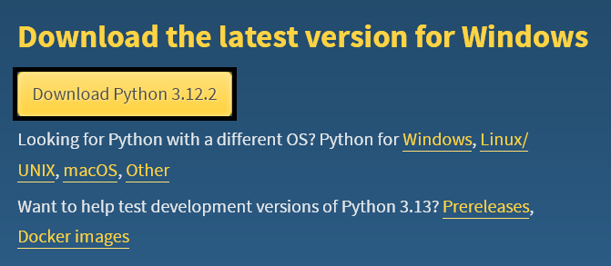
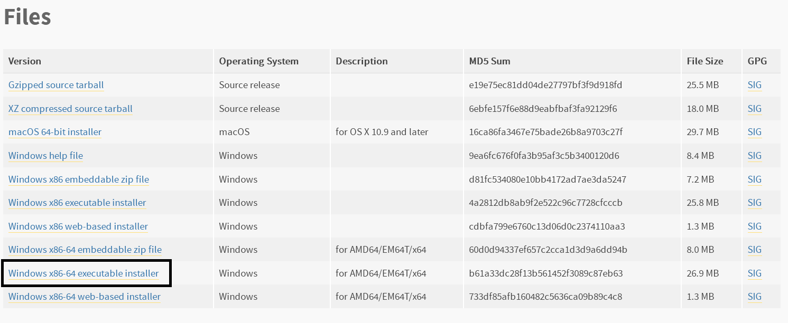
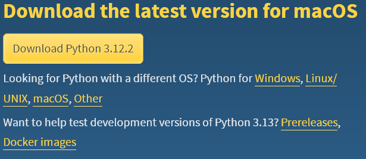

# Python-ni tortib o'lish
## :simple-materialformkdocs: - Bu yerda hali ishlar o'lib borilmoqda :material-alert:

Ho'zir biz python o'rnatuvchisini tortib olamiz

## Windows foydalanuvchilariga
1. Windows 11/10/8/8.1 foydalanuvchilarga: [Python Downloads](https://www.python.org/downloads)

!!! info "Windows 10: Tortish uchun:"
    
2. Windows 7 foydalanovchilar: [Python 3.9](https://www.python.org/downloads/release/python-390)

!!! info "Windows 7: Tortish uchun eng pasga tushib:"
    

## MacOS foydalanovchilariga
!!! info "MacOS foydalanovchilari:"
    <h2> MacOS foydalanovchilari kamida macOS versiyasi (10.15) Catalina bolish kerak </h2>
    

???+ warning "Linux foydalanuvchilarga"
    Linux foydalanuvchilarilarga [o'rnatish paragrafida](#python-ni-ornatish) aytilgan

# Python-ni o'rnatish
Python-ni endi o'rnatish kerak

## Linux foydalano'vchilar uchun
Distributivingiz-ni tekshirish uchun neofetch-bilan tekshirsa boladi
```bash
neofetch
```
> **Va siz ingiliz tilini o'qishni bilsayiz kerak**?

### Ubuntu
Sizda Python tayyor bolishini ishonch hosil qilish uchun bu [paragrafga](#python-ni-ornatilganini-tekshirish-uchun) o'ting

### Fedora
Sizda Python tayyor bolishini ishonch hosil qilish uchun bu [paragrafga](#python-ni-ornatilganini-tekshirish-uchun) o'ting

### Arch Linux
Arch Linux yoki unga oxshash distributivlarga, masalan (EndearvourOS)
```bash
sudo pacman -S python
```

### Debian
Debian yoki unga oxshash distributivlarga, masalan (Ubuntu)
```bash
sudo apt-get install python
```

### OpenSUSE
```bash
sudo zypper in python
```

## Python-ni o'rnatilganini tekshirish uchun
Terminal-ni ochib<br>
Manashu kommanda bilan tekshirsa boladi
```bash
python -V
```
yoki
```bash
python3 -V
```
Natija bunday bolishi kerak:
```bash
Python 3.x
```
va siz muvvofaqiyatli Python-ni o'rnattingiz